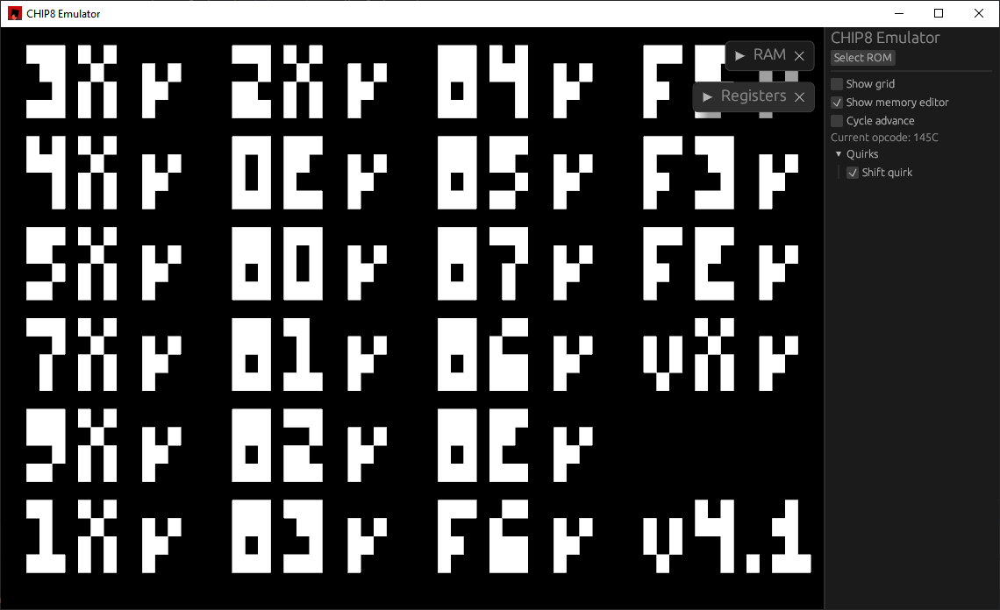
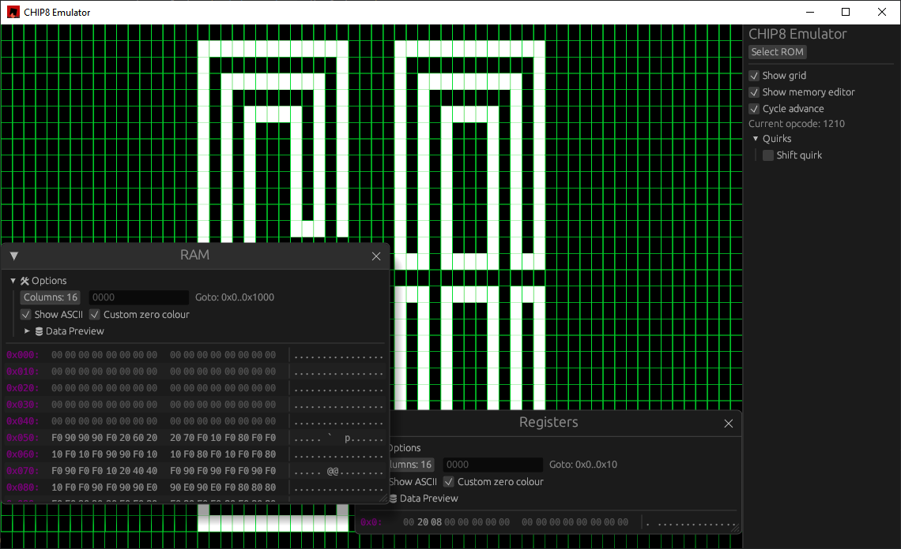

# chipmate
CHIP-8 Emulator/Interpreter written in Rust

# How to install

**Windows**

Download binaries from [Releases](https://github.com/simalei/chipmate/releases) page

**Other platforms**

Run `cargo install chipmate`

# Features 
* Decent emulation of CHIP-8
* Tools for debugging (RAM and registers editor, cycle advance)
* Rendering by [macroquad](https://github.com/not-fl3/macroquad), UI by [egui](https://github.com/emilk/egui)

# Gallery
 

# TODO
- [ ] Introduce FPS-independent rendering delta time
- [ ] Add more quirks
- [ ] Add rewind feature
- [ ] Get full marks in [Timedius' CHIP-8 test suite](https://github.com/Timendus/chip8-test-suite/)
